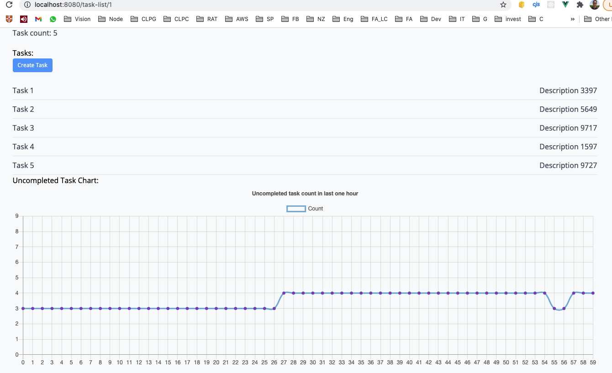

<p align="center"><a href="https://laravel.com" target="_blank"></a></p>

## Documentation

Simple Task management using Laravel + Vuejs. Currently, it divides into two independent projects, Laravel project and Vuejs project (under laravel-vue).


## Features
- Laravel 8
- Vuejs
- Laradock
- User (Register, Login)
- Laravel Seeder
- Multiple Task list
- Task List (Show, Create, Edit)
- Task (Create, Edit, Delete)
- Last hour tasks statictic chart
- PhpUnit
- Postman for testing API




## Todo features:
- Google Login
- HTTPS localhost
- Deploy to production
- HTTPS production
- use AWS RDS
- Repository design pattern
- CICD
- Add Task List automatically after register
- Responsive layout
- Jest
- Remove Task List
- Phpunit for Task
- Combine Laravel + Vuejs into one project using laravel ui

## Setup


### Laravel
#### Laravel with docker
Under project root folder, run below commands.
```
cp .env.example .env
cp laradock/env-example laradock/.env
```
Edit laradock/.env, for example  
PS: Mysql port set to, using this port when you would like to connect to Mysql on localhost.
```
### MYSQL #################################################

MYSQL_VERSION=5.7.25
MYSQL_DATABASE=lrv_task_list
MYSQL_USER=derek
MYSQL_PASSWORD=derek
MYSQL_PORT=15106
MYSQL_ROOT_PASSWORD=root
MYSQL_ENTRYPOINT_INITDB=./mysql/docker-entrypoint-initdb.d
```

Edit .env, especially these fields, SANCTUM_STATEFUL_DOMAINS, SPA_URL are related to Vuejs project.
```
DB_HOST=127.0.0.1
DB_PORT=3306
DB_DATABASE=laravel_api
DB_USERNAME=root
DB_PASSWORD=
SANCTUM_STATEFUL_DOMAINS=localhost:8080
SESSION_DOMAIN=localhost
SPA_URL=http://localhost:8080
```

To start nginx, mysql using docker, run below commands.
```
docker-compose up -d nginx mysql workspace 
```

SSH to workspace project
```
docker-compose exec workspace bash
```

Run below commands.
```
composer install
php artisan migrate
php artisan db:seed
```


### Vue
Under project root folder, run below commands.
Create file .env.local, and set configuration. VUE_APP_API_URL is the URL of Laravel project.
```
VUE_APP_API_URL=http://localhost:8000
```

```
cd laravel-vue
npm install
```

## Run
### Laravel
```
php artisan serve
```

### Vue
Use another terminal
```
cd laravel-vue
npm run serve
```
Default URL will be http://localhost:8080/

### Accounts
User 1:  
Email: dereklam306@gmail.com  
password: derek  

### Development
#### Postman
There is a postman file for testing APIs  
[Postman file](dev_resources/task-list.postman_collection.json )
Set environment varibles:  
api_base_url: http://localhost  
referer: http://localhost:8080  


## Skills
- Laravel 8
- VueJs
- Laravel fortify
- Laravel sanctum
- Laravel Seeder
- Phpunit
- Postman

## Remark
Tested PHP version: PHP 7.3.16 

## Reference
https://laravelvuespa.com/
